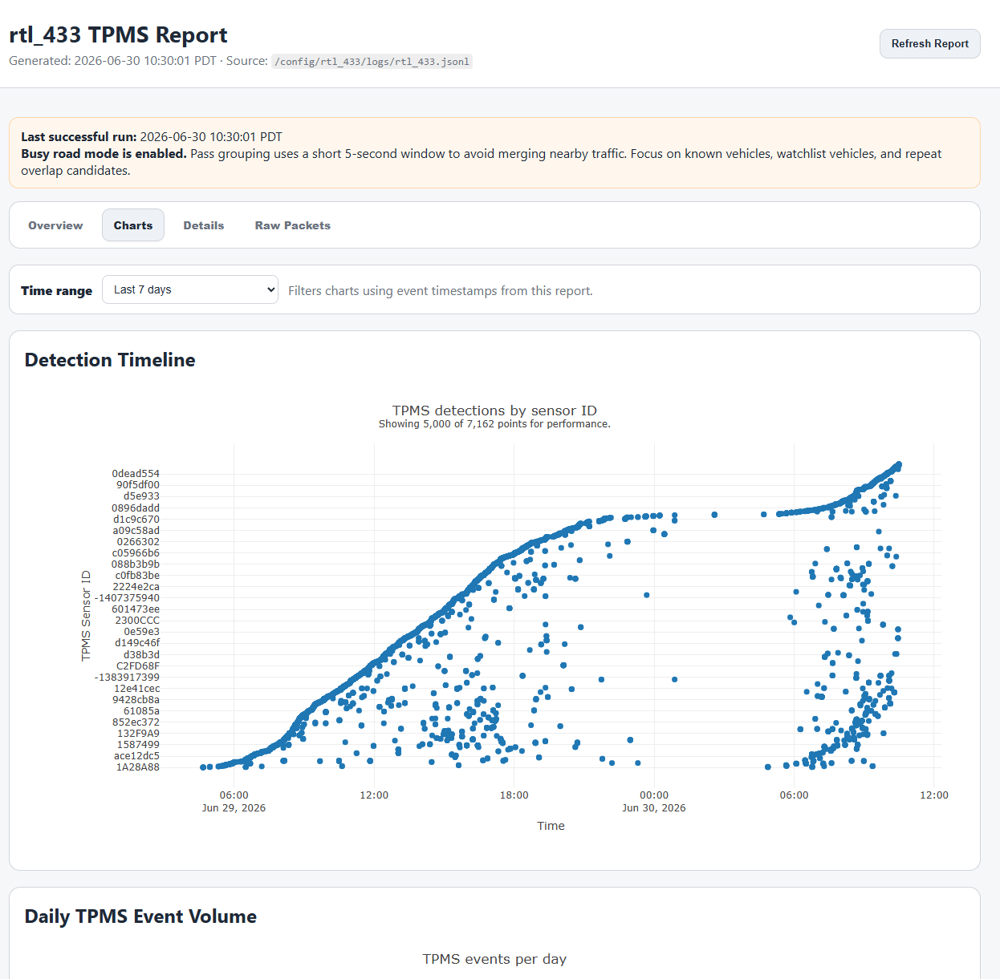

# TPMS Analyzer

TPMS Analyzer is a Home Assistant add-on for `rtl_433` TPMS JSONL logs. It imports tire-pressure sensor events, groups likely vehicle passes, helps identify known, watch, and unknown sensors, and produces a Home Assistant-friendly report for reviewing activity and labeling vehicles.

## Features

* Reads `rtl_433` JSONL log output.
* Stores TPMS events in SQLite with deduplication.
* Groups nearby detections into likely vehicle passes.
* Matches sensors against known, watch, and ignored vehicles.
* Provides report UI controls for vehicle labeling.
* Serves the report through Home Assistant Ingress/sidebar.
* Supports direct web access on port `8099` when exposed.
* Runs manual and scheduled refreshes inside the add-on.



## Requirements

* Home Assistant with add-on support.
* `rtl_433` producing a JSONL log at the path configured in TPMS Analyzer.

## rtl_433 requirement

TPMS Analyzer does not receive radio traffic directly. It reads TPMS events from an `rtl_433` JSONL log file.

Install and start `rtl_433` before using TPMS Analyzer. In Home Assistant, one common option is the `rtl_433` add-on repository:

<a href="https://my.home-assistant.io/redirect/supervisor_add_addon_repository/?repository_url=https%3A%2F%2Fgithub.com%2Fpbkhrv%2Frtl_433-hass-addons" target="_blank" rel="noreferrer noopener">
  
</a>

```text
https://github.com/pbkhrv/rtl_433-hass-addons
```

Install the `rtl_433` add-on from that repository, then configure `rtl_433` to use customary units and write JSON output. `convert customary` is recommended so TPMS pressure values are reported in customary units such as PSI.

```text
convert customary
output json:/config/rtl_433/logs/rtl_433.jsonl
```

The TPMS Analyzer add-on `log_path` option must match the `rtl_433` output path.

## Install

1. Add this repository to the Home Assistant Add-on Store:

   <a href="https://my.home-assistant.io/redirect/supervisor_add_addon_repository/?repository_url=https%3A%2F%2Fgithub.com%2Fgenepool99%2Ftpms_analyzer" target="_blank" rel="noreferrer noopener">
     
   </a>

   ```text
   https://github.com/genepool99/tpms_analyzer
   ```

2. Install **TPMS Analyzer**.
3. Configure the add-on options if needed.
4. Start the add-on.
5. Open TPMS Analyzer from the Home Assistant sidebar or click **Open Web UI** on the add-on page.

## Configuration

| Option | Default | Description |
|---|---|---|
| `log_path` | `/config/rtl_433/logs/rtl_433.jsonl` | Path to the `rtl_433` JSONL log file. |
| `vehicle_map_path` | `/data/vehicles.json` | Persistent vehicle-label map used by the report UI. |
| `scheduled_refresh_enabled` | `true` | Enables the internal daily scheduled refresh. |
| `scheduled_refresh_time` | `03:10` | Daily refresh time in `HH:MM` using the add-on local time. |

## Usage

* Open the report from the Home Assistant sidebar or **Open Web UI**.
* Click **Refresh** in the report to rerun analysis.
* Use the report labeling controls to add sensors to the vehicle map.
* Leave scheduled refresh enabled to refresh the report daily.
* Direct access is available on port `8099` when exposed by the add-on configuration.

## Endpoints

| Method | Path | Description |
|---|---|---|
| GET | `/health` | Checks service health. |
| GET | `/` | Serves the HTML report. |
| GET | `/report` | Serves the HTML report. |
| POST | `/refresh` | Runs analysis and regenerates the report. |
| POST | `/vehicle-map-edit` | Applies report UI vehicle-labeling changes and refreshes the report. |

## Data Locations

| Path | Purpose |
|---|---|
| `/data/vehicles.json` | Persistent vehicle labels. |
| `/data/tpms.sqlite` | SQLite event database. |
| `/data/output/` | Vehicle-map backups and support output. |
| `/config/www/rtl_433/tpms_report.html` | Published HTML report. |
| `/config/www/rtl_433/tpms_status.json` | Published status JSON. |

## Troubleshooting

**No report**
Check `log_path`, confirm the file exists, then click **Refresh** in the report UI.

**No data**
Confirm `rtl_433` is writing JSONL records to the configured log path.

**Vehicle labels are not saving**
Check `vehicle_map_path` and review the add-on logs for write or validation errors.

**Update not appearing**
Reload the Home Assistant Add-on Store, then check for add-on updates again.

## License
MIT License. See [LICENSE](LICENSE).

