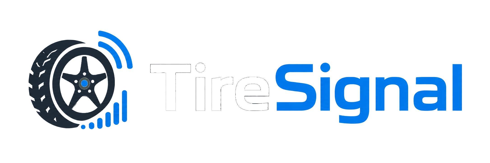

# TireSignal

## Overview

TireSignal is a persistent Home Assistant add-on service for `rtl_433` TPMS JSONL logs. It imports tire-pressure sensor events, groups likely vehicle passes, helps identify known, watch, and unknown sensors, and serves a Home Assistant-friendly report through Ingress/sidebar or direct access on port `8099` when exposed.

## rtl_433 requirement

TireSignal does not receive radio traffic directly. It reads TPMS events from an `rtl_433` JSONL log file.

Install and start `rtl_433` before using TireSignal. In Home Assistant, one common option is the `rtl_433` add-on repository:

```text
https://github.com/pbkhrv/rtl_433-hass-addons
```

Install the `rtl_433` add-on from that repository, then configure `rtl_433` to use customary units and write JSON output. `convert customary` is recommended so TPMS pressure values are reported in customary units such as PSI.

```text
convert customary
output json:/config/rtl_433/logs/rtl_433.jsonl
```

The TireSignal add-on `log_path` option must match the `rtl_433` output path.

## Configuration

| Option                      | Default                              | Description                                                |
| -----------------------------| --------------------------------------| ------------------------------------------------------------|
| `log_path`                  | `/config/rtl_433/logs/rtl_433.jsonl` | Path to the `rtl_433` JSONL log file.                      |
| `vehicle_map_path`          | `/data/vehicles.json`                | Persistent vehicle-label map used by the report UI.        |
| `scheduled_refresh_enabled` | `true`                               | Enables the internal daily scheduled refresh.              |
| `scheduled_refresh_time`    | `03:10`                              | Daily refresh time in `HH:MM` using the add-on local time. |

### Advanced tuning

These options are safe to leave at their defaults for most installs.

| Option | Default | Description |
|---|---|---|
| `enable_pruning` | `true` | Prunes old events from unrecognized sensors. Disable to retain all events permanently. |
| `unknown_sensor_retention_days` | `180` | Days to keep events from unrecognized sensors before pruning. Lower on busy roads to save disk space. |
| `pass_window_seconds` | `5` | Seconds within which readings are grouped as a single vehicle pass. Lower for busy roads, higher for quiet driveways. |
| `min_repeat_cluster_count` | `3` | Minimum times a sensor must repeat within a pass window to be treated as a vehicle sensor rather than road noise. |

## Using the add-on

* Start the add-on from Home Assistant.
* Open TireSignal from the Home Assistant sidebar or click **Open Web UI** on the add-on page.
* Click **Refresh** in the report for manual analysis.
* Use the report vehicle-labeling controls to add or update sensor labels.
* Review the Candidates tab to identify unknown or repeated sensor groups. Use the row action menu (`⋮`) on each row to add a candidate to the watch list, ignore it, move a saved match, or inspect details when available.
* Leave scheduled refresh enabled to refresh the report daily.

## Endpoints

| Method | Path                | Description                                                          |
| --------| ---------------------| ----------------------------------------------------------------------|
| GET    | `/health`           | Checks service health.                                               |
| GET    | `/`                 | Serves the HTML report.                                              |
| GET    | `/report`           | Serves the HTML report.                                              |
| POST   | `/refresh`          | Runs analysis and regenerates the report.                            |
| POST   | `/vehicle-map-edit` | Applies report UI vehicle-labeling changes and refreshes the report. |

## Data locations

| Path                                   | Purpose                                 |
| ----------------------------------------| -----------------------------------------|
| `/data/vehicles.json`                  | Persistent vehicle labels.              |
| `/data/tpms.sqlite`                    | SQLite event database.                  |
| `/data/output/`                        | Vehicle-map backups and support output. |
| `/config/www/rtl_433/tpms_report.html` | Published HTML report.                  |
| `/config/www/rtl_433/tpms_status.json` | Published status JSON.                  |

## Troubleshooting

**No report**
Check `log_path`, confirm the file exists, then click **Refresh** in the report UI.

**No data**
Confirm `rtl_433` is writing JSONL records to the configured log path.

**Label changes not saving**
Check `vehicle_map_path` and review the add-on logs for write or validation errors.

**Scheduled refresh did not run**
Confirm `scheduled_refresh_enabled` is `true`, check `scheduled_refresh_time`, and review the add-on logs.

